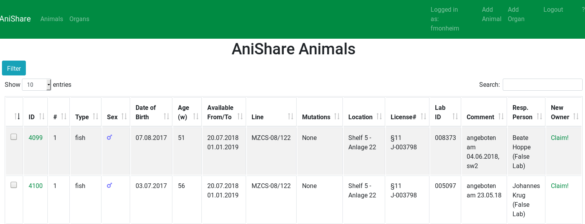
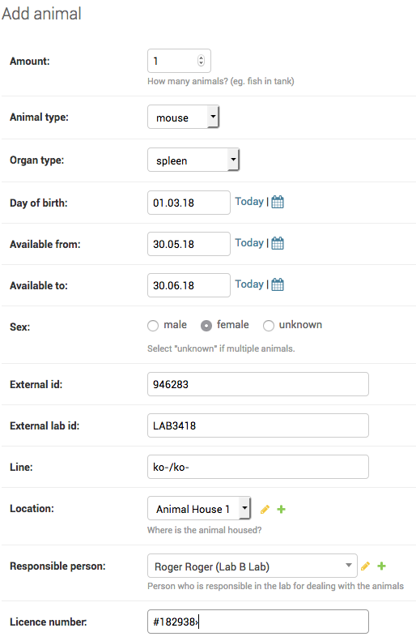
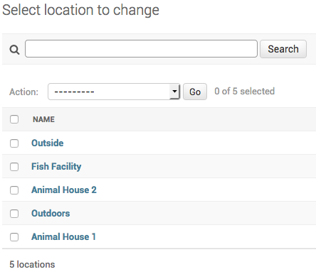
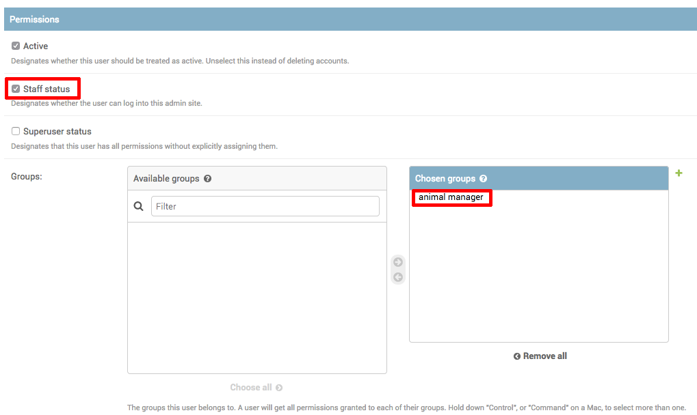

-   [Welcome to the documentation of anishare
    !](#welcome-to-the-documentation-of-anishare)
    -   [Introduction](#introduction)
    -   [Using the software](#using-the-software)
        -   [Main user interface](#main-user-interface)
        -   [Main animal manager tasks](#main-animal-manager-tasks)
        -   [Main administrator tasks](#main-administrator-tasks)
    -   [Installation](#installation)
        -   [Requirements](#requirements)
        -   [First time setup](#first-time-setup)
        -   [Importing existing data](#importing-existing-data)
        -   [In-DB Caching](#in-db-caching)
        -   [Running Tests](#running-tests)
-   [API documentation](#api-documentation)

Welcome to the documentation of anishare !
==========================================

Introduction
------------

**anishare** is a webservice for research institutes to share animals
with the goal to re-use animals and thus minimize total animal usage.

It has been developed at the [Leibniz institute for aging
research](http://leibniz-fli.de) in Jena. This django app is meant to be
used by researchers who want to share research animals with their
colleagues. The basic idea is that animals are bred for experiments;
however, sometimes, not all parts of the animal are used or sometimes an
experiment gets cancelled for whatever reason. By sharing animals within
the institute, less animals in total have to be sacrificed for research.

Anishare is a simple database of animals offered for reuse and a easy
way to claim an animal with automatic generation of email messages as
well as an RSS feed for updates.

At the moment, the software/database is geared towards handling of mice,
however, it can be adjusted to handle any kind of research animal.

Using the software
------------------

The webservice is split in two parts: The **animal input** method is via
the Django Admin interface (See link "Add Animal" top right) and is
meant for *animal managers* only. The **claim** method is via the normal
web interface and is meant for normal users (who need to be
authenticated, though).

### Main user interface

#### Animals

The main user-facing site is the list of animals to be shared. A user
can browse this list, sort it via the headers or search for a term using
the search bar.

If a user is interested in an animal, they should click on the button
"Claim" which will bring up another page (see below) in which they can
review their claim before finally submitting. When they click on "Yes,
I want to claim this!", then they will be entered as *new owner* of
this animal and an email will be send to them as well as the
responsible/contact person informing them about this transaction.
Further steps might need to be necessary such as transferring the animal
in the LIMS (eg. PyRat).

Note: If more than one animal is available, the user can adjust the number
they want to claim. The remaining animals will still be available for
claim.

#### Organs

There exists an individual page for animal organ share. It is very
similar to the animal page, however only individual organs are for
offer. Also there is no availability period, but a day at which the
animal gets sacrificed. The person responsible for killing the animal
will be informed via email if anybody claims some of the available
organs. The entry will remain available to others (as they might want to
claim other organs).

Organ index view:

Organ claim view:

#### RSS Feed

An RSS feed containing the latest ten animals and organs is
automatically generated and can be found at /animals/feed. Users can
subscribe (Most email clients allow the subscription to RSS feeds) to
this feed to stay up-to-date with the animal catalogue. By clicking on a
link in the feed, they are directed to the claim page of the individual
animal/organ.

### Main animal manager tasks

An *animal manager* can add animals and organs to the database.

#### Animals 

Click on `Animals` -> `Add` to add an animal.

All fields in bold **need** to be filled in, the others are optional.

After adding several animals, the main (index) view should look like
this:

#### Organs

Click on `Organs` -> `Add` to add an organ.

All fields in bold **need** to be filled in, the others are optional.

#### Duplicating entries

For input of multiple similar entries, it is possible to duplicate an
animal or organ entry. For this, select one or more entries in the list
(see figure below) and select "copy animal" from the dropdown menu and
click "Go".

Another option is to edit an existing animal and click on
"Save as new". This will save the currently edited animal as a new
instance:

### Main administrator tasks

The administrator can edit more objects in the admin interface, namely
not just animals and organs but also labs, locations and persons:

#### Animals 

The main category to administer are animals to share. Here, several
filters (such as "sex", "location", etc.) are available to search
for any set of animals.

Note: in order to remove a claim (thus making the animal available again),
either click on an animal and remove the email address from the field
"new owner", or select one or multiple animals and select the "clear
claim" *Action* and click "Go".

Note: Once created, an animal cannot be deleted, except by the administrator.

#### Labs

Labs are research labs/research groups and need to have at least one
responsible/contact person each

Note: Only *administrators* are allowed to see and change Labs

#### Locations

Locations are where animals are stored. Usually something like room
numbers or "animal house" or "fish facility".

Note: Only *administrators* are allowed to see and change Locations

#### Persons

Persons responsible for the animals. Could be a vet or similar. Every
animal needs to have a responsible person associated to them. This
person then gets an email when the animal is being claimed.

Note: Only *administrators* are allowed to see and change Persons

#### Make a user an animal manager

The *administrator* is also responsible for user/rights management. In
order to be able to add/edit animals, a user has to be in the group
*animal manager* and have *staff status* in the django admin interface.
For this, an *administrator* has to go to the [user
management](https://anishare.leibniz-fli.de/admin/auth/user/) in the
admin interface by clicking "Home" -> "Authentication and
Authorization" -> "Users". Here, they can make a *user* an *animal
manager*, by setting these values (*staff* and group *animal manager*):

Installation
------------

### Requirements

We use the latest version of [django](https://www.djangoproject.com),
which requires [python3](https://www.python.org). Install django and
other dependancies (see file requirements.txt. We recommend using a
virtual environment for this):

    virtualenv -p python3 .
    source bin/activate
    pip install -r requirements.txt

### First time setup

First, in the folder `anishare`, copy the file
`local_settings.py.template` to `local_settings.py` and fill it in. If
you want to use LDAP, comment in the respective lines. Most importantly,
you should configure the following lines:

    EMAIL_HOST = ''
    SECRET_KEY = ''
    ALLOWED_HOSTS = ['127.0.0.1', ]

Then, you can run migrations:

    python manage.py migrate

Note: This will create the sqlite database `db.sqlite3` containing all the
models (eg. tables) as defined in :py[animals.models]{role="mod"}.

Now create a superuser:

    python manage.py createsuperuser

You are now able to login to the admin interface, but first run the dev
server:

    python manage.py runserver

This will listen on `http://localhost:8000`, so browse to the admin page
`http://localhost:8000/admin` and you should see this after login:

You can also import a dummy set of data using the `loaddata` command:

    python manage.py loaddata initial_data.json

After loading the data, the main admin interface should look like this:

### Importing existing data

For import of existing data in tabular (excel) format, a management
command is available at
:py[animals.management.commands.import\_animals]{role="mod"} :

    python manage.py import_animals

Note: See the file `example_import.xls` for an example\...

### In-DB Caching

By default, database caching is enabled in settings. To create the
necessary tables, run this command:

    python manage.py createcachetable

This will create a cache table in the SQLite database, which will speed
up queries.

### Running Tests

Tests reside in `animals/tests.py`. You can invoke the django tests like
so:

    python manage.py test

### Upgrading django 

To upgrade django or any other python library for anishare, go into the
anishare directory, and activate its virtualenv:

    cd anishare
    source bin/activate

Next, install/upgrade whatever library (here: django to the latest
version):

    pip install --upgrade django

Note: It's best to test the latest version in a local/development environment
first!

#### Upgrading python

When upgrading the python version of the host operating system, it might
be necessary to also upgrade the python in the virtualenv. Otherwise an
error like the following might occur:

> `python: error while loading shared libraries: libpython3.4m.so.1.0: cannot open shared object file: No such file or directory`

In that case, go into the anishare directory, and delete the following
directories:

-   bin
-   include
-   lib
-   lib64

Afterwards, create a new virtualenv and install the required libraries
like so:

    virtualenv -p python3 .
    source bin/activate
    pip install -r requirements.txt
